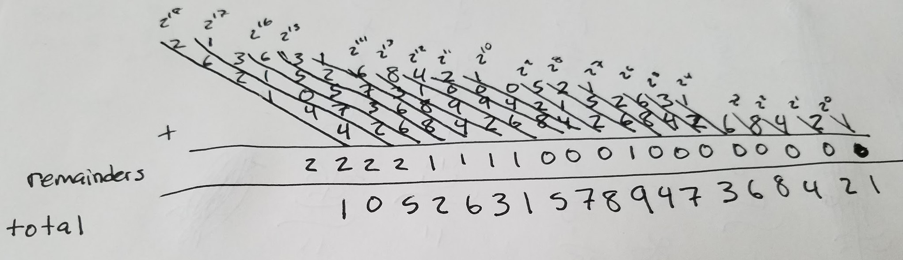

This is a puzzle from [538's The Riddler](https://fivethirtyeight.com/features/can-you-shuffle-numbers-can-you-find-all-the-world-cup-results/) from last Friday. The Riddler Classic asks us to find a positive integer that, when the last digit is moved to the front, is equal to double the value of the original number. This kind of operation, called a [circular shift](https://en.wikipedia.org/wiki/Circular_shift), is common in computer science, especially crytpography.

As always, it is best to restate the word problem in mathematical notation. Let's first imagine we have a positive integer $n$. Since we will be dealing with individual digits, let's express this number using [decimal notation](https://en.wikipedia.org/wiki/Decimal):

$$
n = n_k 10^k + n_{k-1} 10^{k-1} + \mathellipsis + n_1 10 + n_0 
$$

Note that $n$ has $k+1$ digits; this will be important later on. To shift the last digit, $n_0$ to the front, we need to remove it from the sum, divide the remaining terms by ten (thus shifting each to the right), and add on $n_0$ in the highest place. This operation can be expressed mathematically as:

$$
shift(n) = \frac{n - n_0}{10} + n_0 10^k
$$

To see that this works:

$$
\begin{aligned}
\frac{n - n_0}{10} + n_0 10^k &= \frac{1}{10}(n_k 10^k + n_{k-1} 10^{k-1} + \mathellipsis + n_1 10 + n_0 - n_0) + n_0 10^k \\
    &= \frac{1}{10}(n_k 10^k + n_{k-1} 10^{k-1} + \mathellipsis + n_1 10) + n_0 10^k \\
    &= n_k 10^{k-1} + n_{k-1} 10^{k-2} + \mathellipsis + n_1 + n_0 10^k \\
\end{aligned}
$$

Now, any $n$ that solves the riddle will be such that:

$$
\frac{n - n_0}{10} + n_0 10^k = 2n
$$

Solving for $n$ here yields an equation of the form:

$$
n = \frac{10^{k+1} - 1}{19} n_0
$$

This is an equation that will generate integers that double when the last digit is moved to the front. We just need to find an appropriate $k$ and chose what we want the last digit $n_0$ to be.

Now, since $n$ is a positive integer, the right-hand side of the equation must result in an integer. We can apply [Euclid's lemma](https://en.wikipedia.org/wiki/Euclid%27s_lemma) here, which states that, given a prime $p$ and two integers $a$ and $b$, if $p \mid ab$ and $p \nmid a$, then $p \mid b$. We note that $19$ is prime, and that $n_0$ can only be in the range$[0,9]$, so $19 \nmid n_0$. Thus, any $n$ that solves the riddle must have $k+1$ digits such that:

$$
19 \mid 10^{k+1} - 1
$$

(For those unfamiliar with the $\mid$ notation, it is pronounced "divides" and means that the number on the right divided by the number on the left is an integer. For example, $3 \mid 9$ because $\frac{9}{3}=3$, but $3\nmid8$ since $\frac{8}{3}$ is not an integer)

We can restate $19 \mid 10^{k+1} - 1$ as:

$$
\frac{10^{k+1} - 1}{19} = m
$$

for some integer $m$. Now, the numerator here is a number of the form $100\mathellipsis00 - 1 = 99\mathellipsis99$, a string of $k+1$ nines. So we need a number that is a string of nines that is divisible by $19$.

Enter the [full reptend prime](https://en.wikipedia.org/wiki/Full_reptend_prime). A full reptend prime is a prime $p$ where the fraction $\frac{1}{p}$ is a repeating decimal that has a cycle of $p-1$ digits. The first full reptend prime is $7$, because $\frac{1}{7}$ is:

$$
\frac{1}{7} = 0.\overline{142857}
$$

The repeating decimal is made up of six digits that repeat, $142857$. This leads to an interesting and, in our case, useful property. Consider that, as a fraction, adding seven $\frac{1}{7}$s together must equal $1$:

$$
\frac{1}{7} + \mathellipsis + \frac{1}{7} = \frac{7}{7} = 1
$$

Now, consider performing the same operation with the repeating decimal form:

$$
0.\overline{142857} + \mathellipsis + 0.\overline{142857}
$$

How can we add an infinite number of numbers together though? Well, here is a secret: [the number $1$ has two forms, $1$ and $0.999\mathellipsis$](https://en.wikipedia.org/wiki/0.999...), and using this, we can see that:

$$
0.\overline{142857} + \mathellipsis + 0.\overline{142857} = 0.\overline{999999} = 1
$$

This implies that, if we were to extract the repeating digits $142857$ and multiply by $7$, we should get $999999$, which [you can confirm that we do](http://www.wolframalpha.com/input/?i=142857+*+7). From this, we can state generally that for any full reptend prime $p$:

$$
\frac{10^{p-1} - 1}{p} = r
$$

where $r$ is the first $p-1$ digits of the fraction $\frac{1}{p}$. This equation is incredibly similar looking to $\frac{10^{k+1} - 1}{19} = m$. Fortunately for us, $19$ also happens to be a full reptend prime, since $\frac{1}{19}$ has eighteen repeating digits:

$$
\frac{1}{19} = 0.\overline{052631578947368421}
$$

This implies that the values for $k$ and $m$ satisfy $\frac{10^{k+1} - 1}{19} = m$ when $k + 1 = p - 1 = 18$ and $m = 52631578947368421$:

$$
\frac{10^{18} - 1}{19} = 52631578947368421
$$

[You can verify that this indeed works](http://www.wolframalpha.com/input/?i=(10%5E18+-+1)+%2F+19).

Because $19$ is a full reptend prime, we know that $10^{18} - 1$ is the first value that satisfies $\frac{10^{k+1} - 1}{19} = m$, but you can run through all possible $k$ from $1$ to $17$ to check yourself. If you do, you will see a pattern where each $k$ closer to $17$ adds more of the digits of $52631578947368421$ to the result until you finally get an integer.

The above means that the lowest $k$ value possible is $k = 17$, meaning that the smallest $n$ that solves the riddle has eighteen digits in it. We can in fact compute what this value is using an equation we computed above:

$$
n = \frac{10^{k+1} - 1}{19} n_0
$$

Plugging in $\frac{10^{18} - 1}{19} = 52631578947368421$:

$$
n = 52631578947368421\;n_0
$$

As a sanity check, we will note that since $n_0$ is the last digit of $n$, having $52631578947368421$ end in $1$ makes a lot of sense. Now, we just have to pick $n_0$. Obviously, $0$ doesn't make sense, and neither does $1$. So, we can try $n_0 = 2$:

$$
n = 52631578947368421 * 2 = 105263157894736842
$$

Moving the last digit of $105263157894736842$ to the front gives $210526315789473684$, and in the true test of our work, we can confirm that [$105263157894736842 * 2 = 210526315789473684$](http://www.wolframalpha.com/input/?i=105263157894736842+*+2). Since $n_0 = 2$ results in the smallest $n = 52631578947368421\;n_0$, the solution to the riddle is:

$$
\boxed{n = 105263157894736842}
$$

Above, we were given the ability to pick the last digit, $n_0$. You can verify that any $n_0$ in the range $[2,9]$ works. Interestingly, all choices result in the same sequence of numbers, $052631578947368421$, just circularly shifted by some amount. In fact, if we include the leading zero in $052631578947368421$, we note that $n_0 = 1$ works as well, since [$052631578947368421 * 2 = 105263157894736842$](http://www.wolframalpha.com/input/?i=52631578947368421+*+2).

So, we can dust our hands off and say job done. But why do the digits of $\frac{1}{19}$ produce this solution? Well, there is an interesting pattern in the digits. Can you spot it?  Here is a hint: the first four powers of $2$ are $2^0 = 1$, $2^1 = 2$, $2^2 = 4$, and $2^3 = 8$, which makes the last four digits of $052631578947368421$ worth a closer look:

$$
\begin{gathered}
8\enspace4\enspace2\enspace1 \\
2^3 2^2 2^1 2^0
\end{gathered}
$$

But what about that $6$? Well, $2^4 = 16$, so the 6 must come from $16$. But what about $3$ then? Well, $2^5 = 32$, but what happens when we add the $1$ from the $16$ that we haven't yet used? We get $32 + 1 = 33$. There's that $3$!

It turns out that we can use the powers of two to construct the digit pattern $052631578947368421$. To do so, make a triangle made up of the powers of two as follows:

Along the diagonals are the powers of $2$. Each digit of $052631578947368421$ is constructed by adding the columns of the triangle, keeping track of the carry over from the previous column. For example, the eigth column from the right is the sum of the $6$ from $2^6 = 64$ and the $8$ from $2^7 = 128$, which results in a $14$. So we write down a $4$ underneath the column, and carry over the $1$ to the next column, which sums to $2 + 6 + 1 = 9$. The pattern of digits repeats the same $052631578947368421$ as you add more and more powers of two to the triangle. It is this powering of two that allows the digit pattern to double whenever you shift. Since the pattern repeats, shifting is the same as sliding over by one column, which is the same as increasing the power of two by $1$, also known as multiplying by $2$.

This pattern is related to the number $19$ precisely because of the equation $n = \frac{10^{k+1} - 1}{19} n_0$. The $19$ came out when trying to double a number when shifting. We can find a similar result for tripling a number:

$$
\frac{n - n_0}{10} + n_0 10^k = 3n \implies n = \frac{10^{k+1} - 1}{29} n_0
$$

This suggests that $29$ should have the same relationships with powers of $3$ as $19$ does with powers of $2$, and if we look at the fraction $\frac{1}{29}$, we can see this:

$$
\frac{1}{29} = 0.\overline{0344827586206896551724137931}
$$

The last four digits $7931$ come from $3^3 3^2 3^1 3^0$ in the same way as with the powers of two, and if you construct a powers of three triangle like the one above, you can recover the entire sequence (though where the power of two sequence has eighteen digits, the power of three sequence has 28). This same trick works for any integer multiple $m$, which gives a general equation:

$$
\frac{n - n_0}{10} + n_0 10^k = m n \implies n = \frac{10^{k+1} - 1}{10m - 1} n_0
$$

allowing any fraction of the form $\frac{1}{10m - 1}$ to be computed exclusively from the powers of $m$. Note however that not all values $10m - 1$ are full reptend primes, and so the number of digits in each sequence will vary. For example, while the $m = 2$ gives 18 digits and $m = 3$ gives 28 digits (representing the fact that $19$ and $29$ are full reptend primes), $m = 4$ does not, since $39$ is not a prime. As such, $\frac{1}{39} = 0.\overline{025641}$ has only six digits.

In summary, a nifty riddle about shifting and doubling has led to an interesting discovery about a fundamental relationship between numbers, and we have found a cool way to compute certain fractions using some basic powers and a bit of adding.