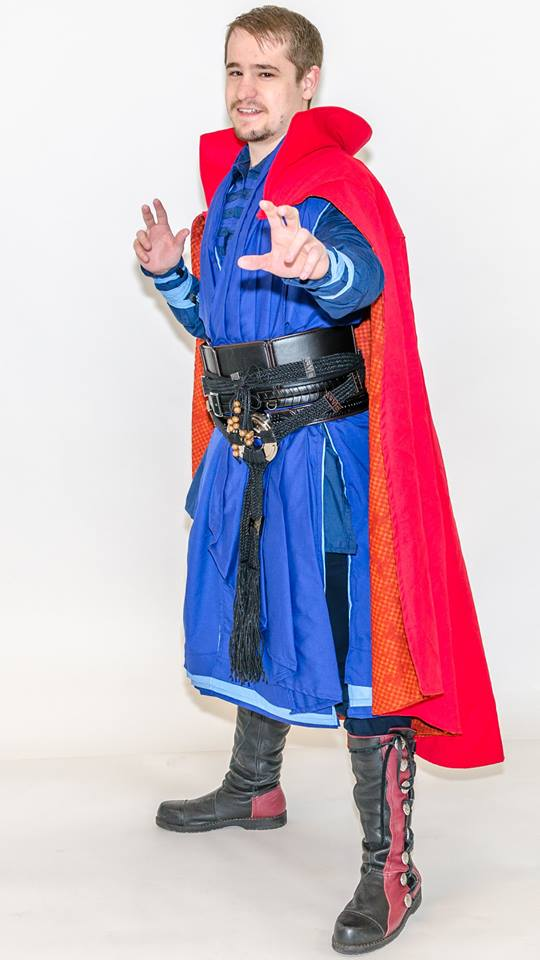

For Halloween 2017, I decided to make a Dr. Strange costume, which could then be used for cosplay purposes at various events the next year.  Compared to my previous year's [Kylo Ren costume](), the outfit Dr. Strange wears in 2016's [_Dr. Strange_](http://www.imdb.com/title/tt1211837/) is both more colorful and more varied in texture and flow.

<md-image src="https://ia.media-imdb.com/images/M/MV5BYjE4Yjg3MmUtZTM2Mi00NDM2LWFkNDEtNTQxMGM0ZTllNGYxXkEyXkFqcGdeQXVyNDUwNzM4MzQ@._V1_SY1000_CR0,0,1341,1000_AL_.jpg" link="link" caption="Source: imdb.com"></md-image>

The costume can be divided into three primary distint pieces: the cloak, the tunic, and the undertunic. Additionally, the belt, boots, gauntlets, and the Eye of Agamotto amulet complete the costume.

As a starting point, I used a [McCall's costume pattern](https://mccallpattern.mccall.com/m7676) that included all three pieces, and made some modifications to make the costume a bit more accurate.

### Undertunic
This is the simplest piece, and also the least seen piece thoughout the film. It appears to be made out of a single color, navy blue, and it is made out of a light and thin fabric, appearing to be just above knee length. It also appears to have a placket and collar made up of interwoven straps of alternating hues of blue.

<md-image src="http://www1.pictures.zimbio.com/fp/Benedict+Cumberbatch+Benedict+Cumberbatch+e5ESZE6bORix.jpg" link="link" caption="Source: comicbookmovie.com"></md-image>

I chose to go with a [poly-cotton blend fabric](http://www.joann.com/symphony-broadcloth-solid-quilt-fabric/640771.html) for both the undertunic and tunic, primarily because it is light and airy and has a semi-coarse texture. It also comes in a variety of strong hues, and is a cheap fabric. For the placket and collar, I used leftover strips of blue from the tunic, sewn together into two pieces.  These were sewn directly onto the front of the undertunic, with a few hook and eye fasteners to secure them together to the neck.

### Tunic
Dr. Strange's tunic is sleeveless with a high collar, and extends to just above the boot line. Several pleats are sewn onto the front of the tunic, and appear to wrap around the neck and hang down the front. Several patterns are embroidered on the front of the tunic as well. It is a slightly lighter hue of blue compared to the undertunic.

<md-image src="https://ia.media-imdb.com/images/M/MV5BMGI1ZDNkM2QtMGIxNC00MDQwLTg2MjMtYmUzZjM5ODgyNWViXkEyXkFqcGdeQXVyNjUyNjI3NzU@._V1_.jpg" link="link" caption="Source: imdb.com"></md-image>

It isn't particularly obvious, but the tunic is actually made out of five identical layers. This is most obvious at the hem of the tunic, where each layer ends at a different length, forming a tiered hem. Further, at least two of these layers is a lighter shade of blue than the other two. 

<md-image src="https://static0.srcdn.com/wp-content/uploads/SDCC-2016-Doctor-Strange-Costume.jpg" link="link" caption="Source: screenrant.com"></md-image>

A simple way to accomplish this effect would be to make a single layer and sew a few strips of fabric to the hem to duplicate the layering, but using five full layers gave the tunic a nice solid, stiff feel to it, in addition to being movie accurate. I opted to use the same poly-cotten blend for the tunic that I did for the undertunic, going with dark royal and icy blues for the coloring. Duplicating the layers required quite a bit of fabric, which is the main reason for choosing a cheap fabric for the tunic.

The costume pattern I used had the pleats as an integrated part of the tunic, but I opted to separate the pleats into a single strip that was sewn on top of the five-layered tunic at the belt line and wrapped around the neck, forming the collar.  To get a nice stiff collar, I sewed some interlacing in as well. A second strip of pleats was sewn at belt line to dangle on one side. I opted to add a small fastener to secure the tunic closed at the waist, mainly to help keep it properly closed as the belt is put on.

### Cloak
The most recognizable part of the costume is the Cloak of Levitation. This is also the most complex part of the costume. The cloak is a solid red color, made up of a thick drape-like fabric and a stiff, high collar. The inner lining is a red and gold checkered pattern. A complicated trim lines the front edge of the cloak as well as forming a circular patch on one shoulder. The shoulders and collar of the cloak have a very complicated and intricate pattern of squiggles, and several strips of material radiate out from the shoulder patch across the back of the cloak, with additional patches sewn along the lines.

I made the cloak from a [cotton twill fabric](https://www.fabric.com/buy/0269370/cotton-twill-red) specifically for its use with drapery. For lining fabric, I chose a [red plaid cotton](http://www.joann.com/keepsake-calico-cotton-fabric-43in-red-plaid/13911409.html) fabric. At this time, I have not found an ideal trim, and have not been able to add any of the intricate detail to the cloak.

The custome pattern I used sized the cloak to hang fully behind the shoulders, but Dr. Strange's cloak is large enough to drape over the shoulders. To accomplish more shoulder drape, I had to increase the size of the cloak a bit. I also sewed a couple magnets to the tips of the cloak and into the tunic, so that the cloak can be easily flung on or off, similar to how it works in the movie.

### Accessories
Dr. Strange's gauntlets appear to be made up of several woven strips of fabric that cover most of the forearms. In order to make these easy to put on and take off, I made some fabric gauntlets, stiffened with interfacing, out of the same color as the undertunic, so that I could slip them on and off without having to lace up anything. I then used several leftover strips from the tunic and sewed them on in a woven pattern that could be tightened and secured with velcro once the gauntlets were on.

I purchased a [prop replica belt](https://www.amazon.com/gp/product/B071ZV6DW3/ref=oh_aui_detailpage_o03_s00?ie=UTF8&psc=1) online, and am very pleased with its quality. It is made up of four parts: the sash belt, two patterned belts, and a braided rope belt with large metal loops.

I utilized a pair of boots I aquired at a local renaissance fair, and a set of navy slacks to round of the costume.

For the amulet, I purchased a [prop replica](https://www.amazon.com/gp/product/B0744QD1NG/ref=oh_aui_detailpage_o00_s00?ie=UTF8&psc=1) of the Eye of Agamotto.

### Altogether
I am pretty pleased with how the costume turned out. While not wholly movie accurate, I feel that the costume exemplifies the main attributes while being a functional and durable set of clothing.

