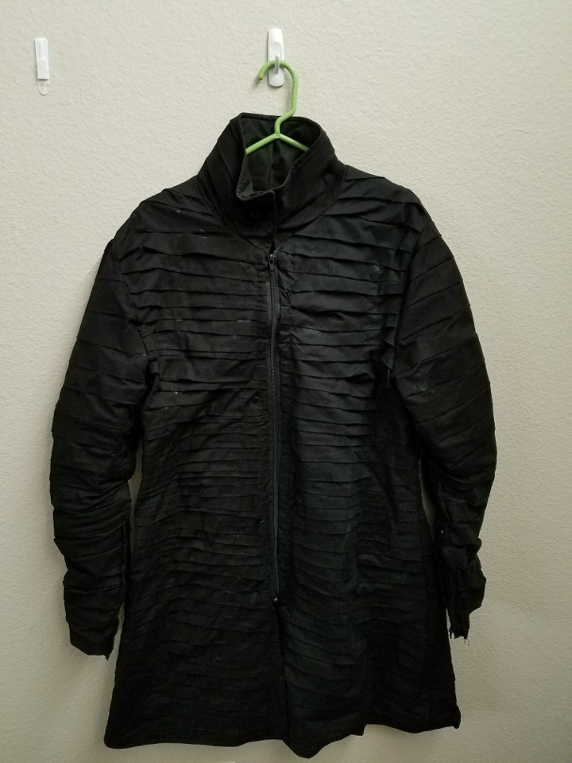
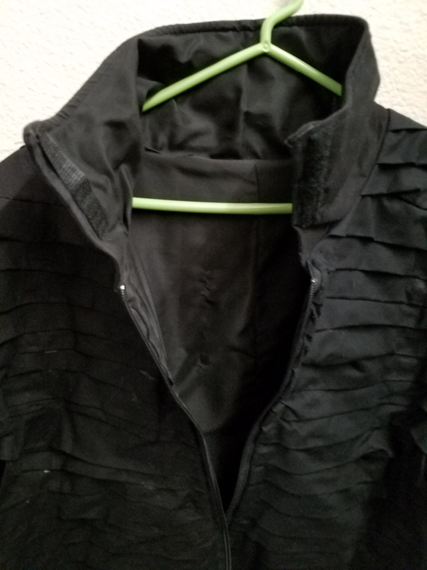
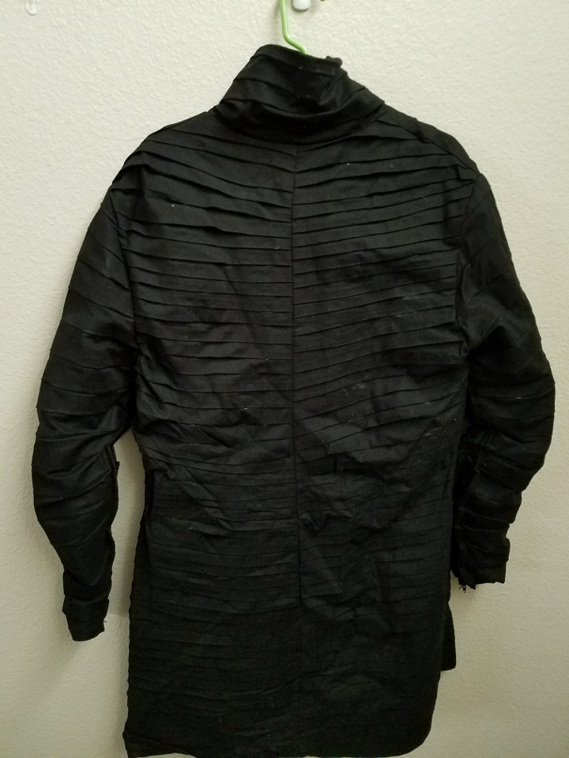
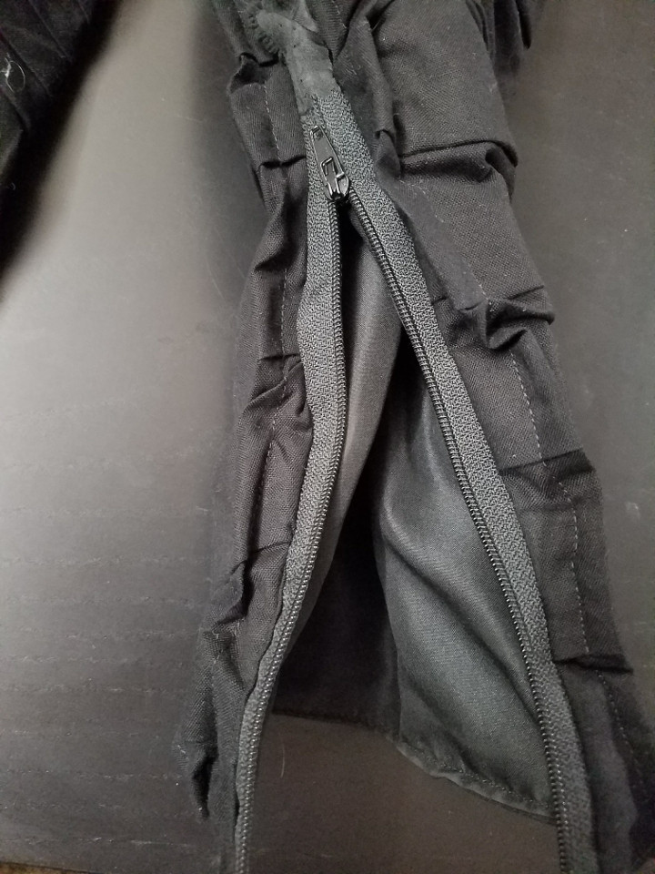
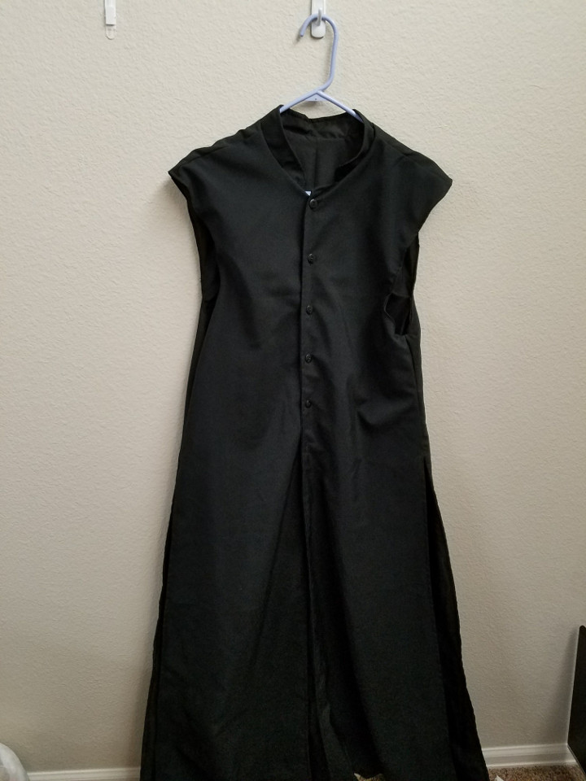
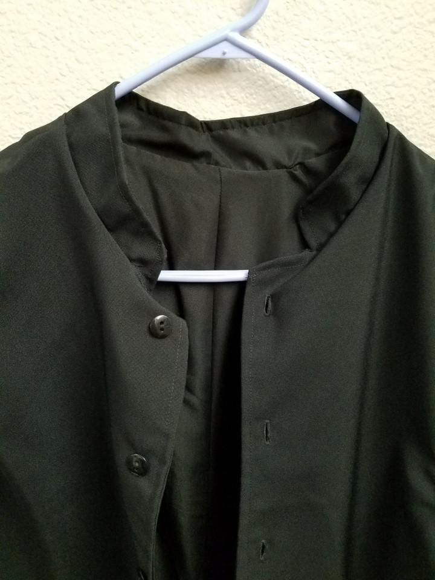
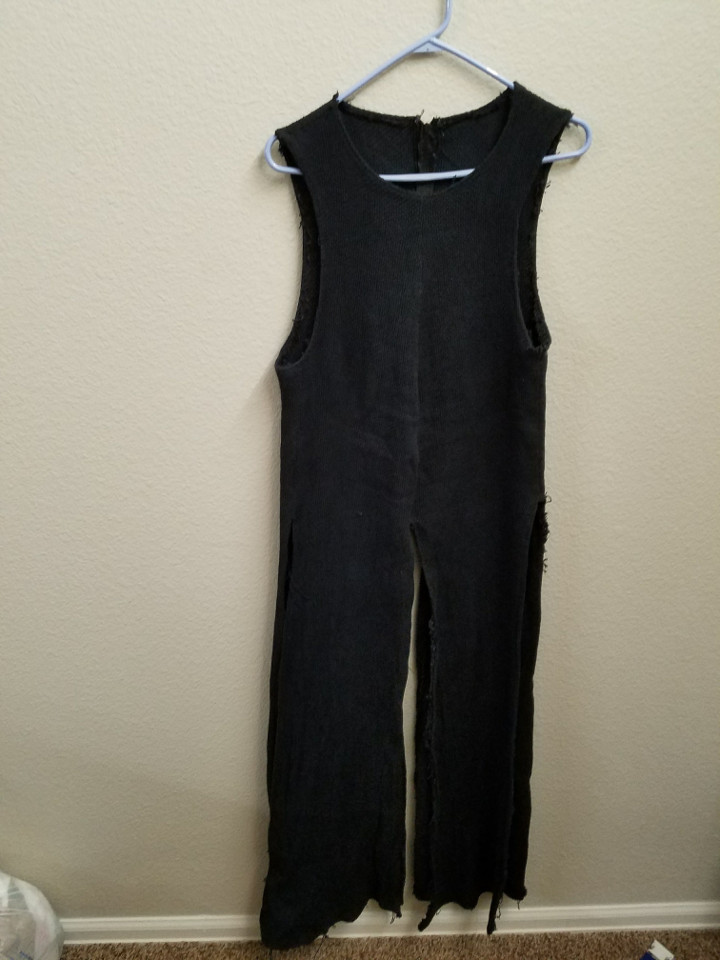
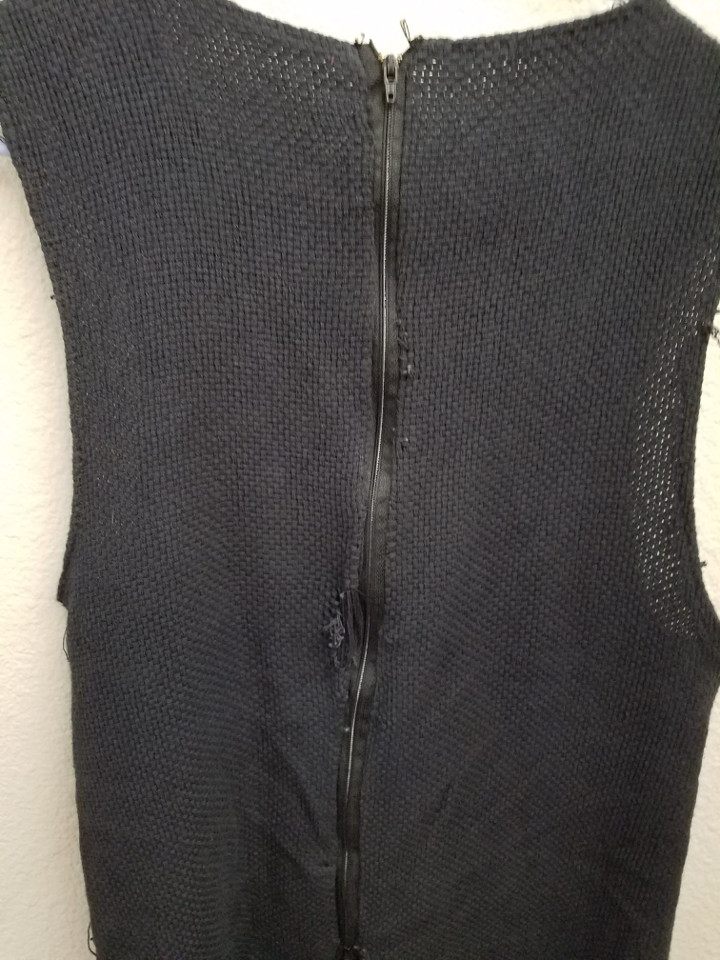
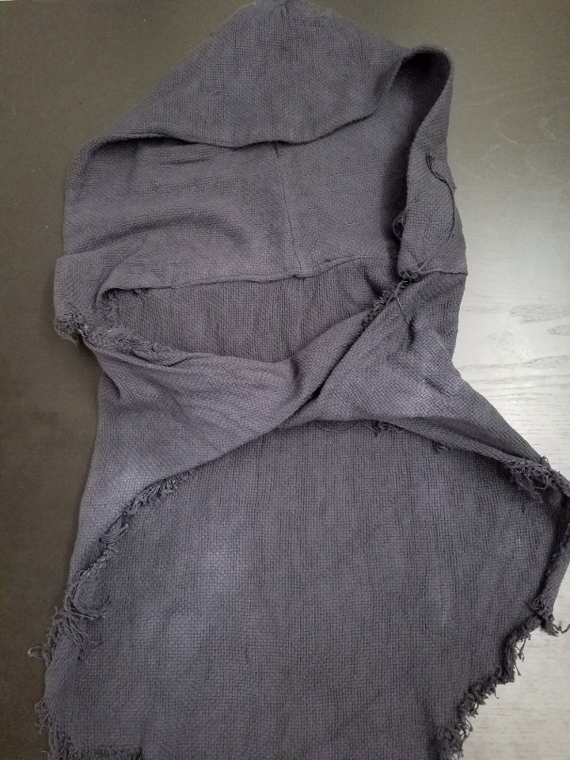
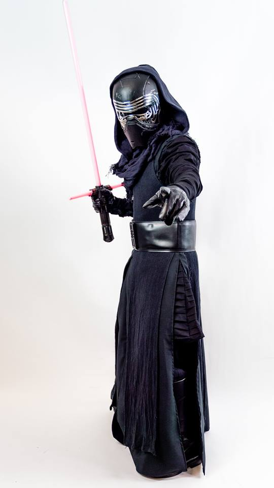

For Halloween 2016, I wanted to to make a costume for my favorite Star Wars character from [_Star Wars: The Force Awakens_](http://www.imdb.com/title/tt2488496/?ref_=fn_al_tt_7), [Kylo Ren](https://en.wikipedia.org/wiki/Kylo_Ren). When I was a child, my mother would sew all of our Halloween costumes, and when I got old enough, she taught me how to sew so that I could make my own costumes. This Kylo Ren costume was the first costume I had attempted since then, and much of this project was about relearning how to sew.

<md-image src="https://ia.media-imdb.com/images/M/MV5BMTYxOTk4MDkxMF5BMl5BanBnXkFtZTgwNzU0ODUzNTE@._V1_SX1777_CR0,0,1777,744_AL_.jpg" link="link" caption="Source: imdb.com"></md-image>

A great overview of the various pieces of his costume can be found at the [501st Legion costume library](https://databank.501st.com/databank/Costuming:Kylo_Ren). The 501st Legion is an organization of cosplayers that dress up as various characters (primarily villains) from Star Wars. They maintain a very high standard for costume quality. Though I did not intend for the costume to meet their stringent requirements, I found their breakdown of the Ren costume to be incredibly useful.

I also utilized a [McCall's costume pattern](https://mccallpattern.mccall.com/m7422), which contained patterns for all the general pieces of the costume, though I made a few modifications to make the costume a bit more accurate.

The costume can be divided into four main pieces: the undercoat, the midcoat, the surcoat, and the hood. Accessories will include the belt, gloves, boots, helmet, and lightsaber. All of the fabric will be black

## Undercoat
Kylo Ren's undercoat is a thigh length pleated tunic with a high-neck collar. Though through most of the movie only the pleated sleeves are seen, the entire tunic is pleated.

<md-image src="https://imagesvc.timeincapp.com/v3/mm/image?url=https%3A%2F%2Fewedit.files.wordpress.com%2F2016%2F04%2Fdfhzhzdfzdfh.jpg" link="link" caption="Source: ew.com"></md-image>

This is the most complicated piece of the costume, and took the most time to produce, because it is made entirely of [pleated fabric](https://en.wikipedia.org/wiki/Pleat). For ease, I would recommend getting already pleated fabric if you can find some, but for this costume I pleated my own fabric. The 501st legion costume guide suggests dividing this costume into three parts, one for the sleeves, one for the tunic, and one for the neck seal, but I chose to combine them into a single, fully pleated tunic with a high collar. I used a black cotton material for this piece, and pleated the fabric before cutting out the pattern. The pleats are roughly one inch wide, though I feel I made the sleeves a bit too large. The pleats should be made to proportion, with 30 to 35 pleats along the arm. I used a zipper down the front and some velcro on the collar to secure it around the neck, and sewed a lining into the tunic to make it more comfortable to wear.

<image-carousel id="undercoat-carousel">
    
    
    
    
</image-carousel>

## Midcoat
This piece isn't generally seen for most of _The Force Awakens_, but it is the coat that Ren wears during the final battle in the snowy woods. Though it isn't clear, and most references don't include the midcoat, I believe that the midcoat is always under the surcoat for the entire film. Regardless, wearing both the midcoat and the surcoat adds more volume and weight to the costume, which is particularly important for a menacing figure.

<md-image src="https://ia.media-imdb.com/images/M/MV5BMWEzOWZiNTYtN2ZmZi00NWYyLWFmYTktMDZkNDczNGUzYzNlXkEyXkFqcGdeQXVyNDUzNzIxMzk@._V1_.jpg" link="link" caption="Source: imdb.com"></md-image>

Though it is hard to see much of the texture of this coat due to the low light in the scenes it is in, it has some distressed pattern to it. For simplicity, I did not use textured fabric, and instead went for a heavy wool. The pattern is similar to the surcoat, a floor length sleeveless coat with divides in the tunic along the front, sides, and back. The midcoat also has a short military-style collar. I used buttons to secure the coat up the front and sewed in a lining for this piece as well.

<image-carousel id="midcoat-carousel">
    
    
</image-carousel>

## Surcoat
Ren's surcoat is the top layer of his outfit.

<md-image src="https://amp.businessinsider.com/images/55d5ecd8dd08950b058b468c-750-563.jpg" link="link" caption="Source: businessinsider.com"></md-image>

Certainly the most iconic piece of the costume in terms of texture, the surcoat appears to made of a rough thick weave. I struggled to find a fabric in the local fabric supplies shops, but finally found some [monk's cloth](https://www.joann.com/natural-monkscloth/1108547.html) which had a nice texture to it. Since the fabric only came in white, I had to dye the fabric black, which took several dying iterations to get a deep enough shade. I did make the mistake of cutting out the pattern before dying, thinking that having less fabric to dye would concentrate the color, but as the fabric was 100% cotton, it ended up shrinking from the dying process and the end result was a coat that was much smaller than I had intended. With the lesson learned, I do intend to redo the surcoat at some point.

I did not have enough dyed fabric at the time, but the hemming of the coat seen in the movie suggests that the surcoat is double layered. I did not make my version double layered, and simply hemmed in the edge. With such a rough fabric, this resulted in some fraying, which while it does give an interesting look, is not accurate to the movie costume. The costume appears to have a seam up the middle front, though it isn't clear if there is a hidden zipper there. I decided to have a zipper in the back, though this does make the coat difficult to put on.

<image-carousel id="overcoat-carousel">
    
    
</image-carousel>

## Hood and Cape
Kylo Ren's hood and cape are made from the same material as the surcoat. The cape appears to hang to about waist level, and is wrapped around the neck like a scarf. It also has extremely raw and frayed edges. It also isn't a clean flap of fabric, but looks more haphazardly shaped, with a skewed draping appearance.

<md-image src="https://ia.media-imdb.com/images/M/MV5BOTgwNTEwNDkwNV5BMl5BanBnXkFtZTgwMzQzMTY1MzE@._V1_SX1777_CR0,0,1777,744_AL_.jpg" link="link" caption="Source: imdb.com"></md-image>

I constructed the cape by cutting a relatively random and wandering edge that had two scarf-like trailing edges. To this I sewed the hood. Ren's hood, like his surcoat, appears to be double layered, and I did do the double layering here, allowing for a clean seam along the edge. The hood is pretty large, as it has to drape over the helmet, so I made sure to use an adequate amount of fabric. Wrapping the scarf-like edges around the neck and tucking them in gives a nice draping scarf.

<image-carousel id="hood-cape-carousel">
    
</image-carousel>

## Accessories
For the helmet, I purchased [Hasbro's Kylo Ren Black Series helmet](https://www.amazon.com/Star-Wars-Black-Changer-Helmet/dp/B00TQYB2EO/ref=sr_1_4?ie=UTF8&qid=1522907039&sr=8-4&keywords=black+series+kylo+ren). This helmet is mostly plastic, but is fairly detailed and is the easiest option I found. It is advertized to contain a voice changer as well, but it doesn't work well, as the helmet causes a lot of feedback for the microphone that ultimately makes the voice changer useless.

I also acquired a simple [Kylo Ren costume belt](https://www.amazon.com/gp/product/B01AJHFX6E/ref=oh_aui_detailpage_o01_s01?ie=UTF8&psc=1), which velcros in the back. I used some black costume boots I had purchased for a Renaissance fair, and purchased simple black leather driving gloves as well.

The lightsaber I used was the [Hasbro Black Series Kylo Ren lightsaber](https://www.amazon.com/Star-Wars-Black-Deluxe-Lightsaber/dp/B00YTZE7B0/ref=sr_1_7?ie=UTF8&qid=1522907298&sr=8-7&keywords=black+series+lightsaber), which is a prop replica that features an LED lit blade and accurate sound effects. Though the unstable blade isn't well conveyed, the lightsaber is very fun to sling around in the dark.

## Altogether
As this was my first effort in sewing in a long time, I am pretty happy with the costume. There are several areas I would improve on, especially with the experience I have since gained, and may return to fix some of the issues at some point. However, the overall costume is definitely recognizable, and enjoyable to wear.

