Source for UDK build: [Extron/NLH-UDKSource](https://github.com/Extron/NLH-UDKSource)

Source for UE4 build: [Extron/NLH](https://github.com/Extron/NLH)

No Longer Human was designed to be a first-person multiplayer arena shooter.  I worked on this game constantly through college, though after graduating (and having a fallout with the friend I was working on it with) haven't gone back to it.

No Longer Human was initially developed in Unreal Engine 3, using Epic's [Unreal Development Kit (UDK)](https://www.unrealengine.com/en-US/previous-versions). After several years of work, I realized that UE3 was not technologically capable of doing what we wanted to do, and Unreal Engine 4 had just come out. I made the decision to switch over to UE4, but this required starting the project over from scratch. Hardly any of the work we had done could be converted to UE4. Not much progress was made on the UE4 version of the game.

## Contents
* ####[Elevator Pitch](#elevator-pitch-1)
* ####[Abilities](#abilities-1)
* ####[Weapons](#weapons-1)
* ####[Armor and Body Parts](#armor-and-body-parts-1)
* ####[Bot Battle](#bot-battle-1)
* ####[Development](#development-1)
* ####[Deployment](#deployment-1)
* ####[Future](#future-1)

## The Elevator Pitch
I conceived the game as a team-based multiplayer arena first-person shooter. Players would pick a class, and each class had a set of abilities that governed its play style. A fundamental aspect of these abilities was that they would interact with each other, allowing players to team up and combine abilities together in interesting and unique combinations. Early on, this was dubbed the "rock-paper-scissors" mechanic, where each ability would have strengths and weaknesses that complimented the other abilities. I decided to make the classes based on elements like fire, water, and earth, which allowed each class to embody both a color and concept.

A secondary element of the game was player customizability. The player was able to essentially construct armor, weapons, and body parts using components, and combining different components together would change or grant interesting effects and abilities. There were categories of weapons and armor that gave a base set of properties, and modular components would be attached to them to vary their properties.

As elemental abilities were a core mechanic, the game also featured a dynamic weather and day/night system that would affect how effective abilities were. For example, a match could start out with fair weather, during which abilities are normally effective. As the match progressed, it could start snowing, which would reduce fire related abilities and weapons and enhance water and ice abilities. This also provided variation to multiplayer maps that are usually not present in most games.

## Abilities
The core mechanics of the game were the abilities. These were organized into elemental classes; lightning, earth, water, fire, air, and teleportation. Each class had a hierarchy of abilities, and these abilities were catered to a specific play style. For example, the lightning class was a high-damage one-vs-one class, while the earth class was a support area-of-effect class. 

<image-carousel id="nlh-abilities-carousel">
    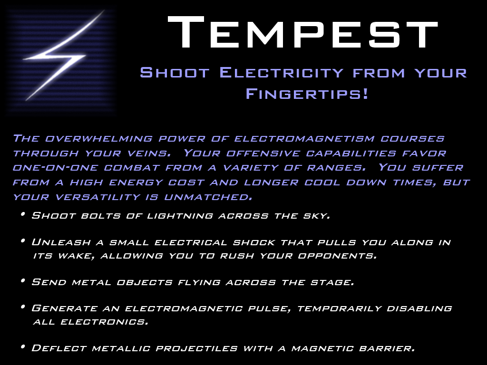
    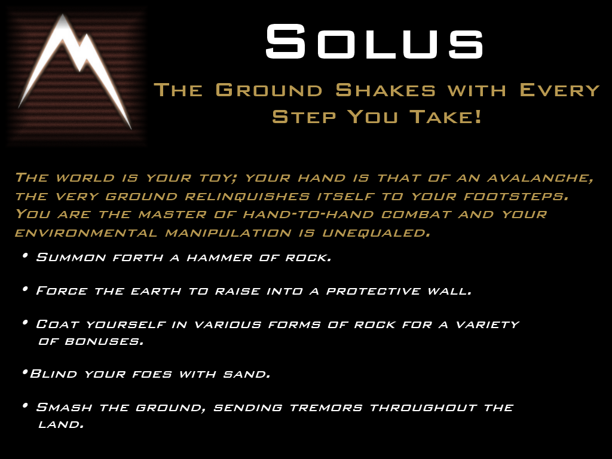
    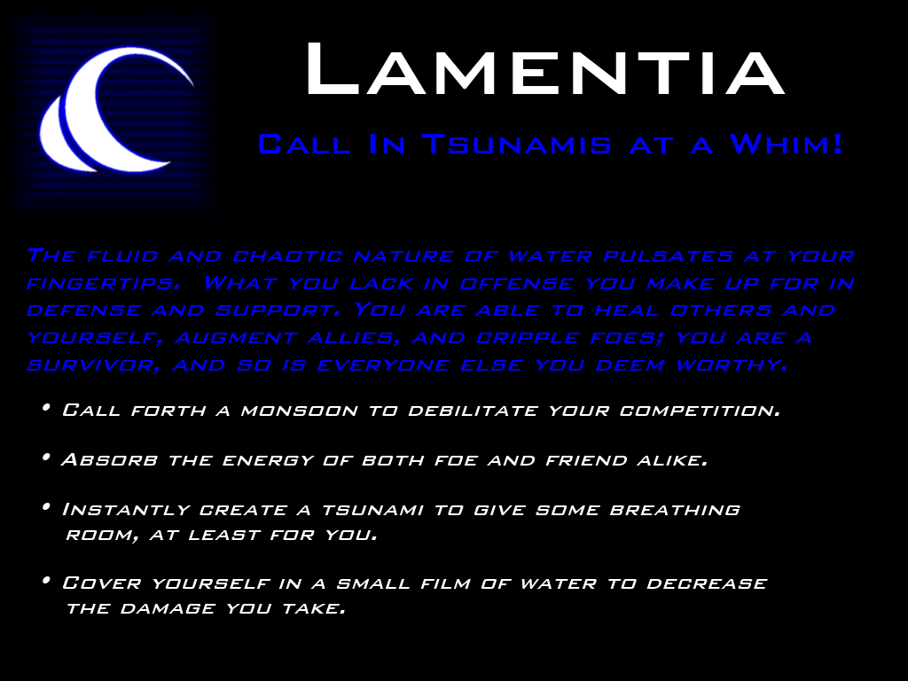
    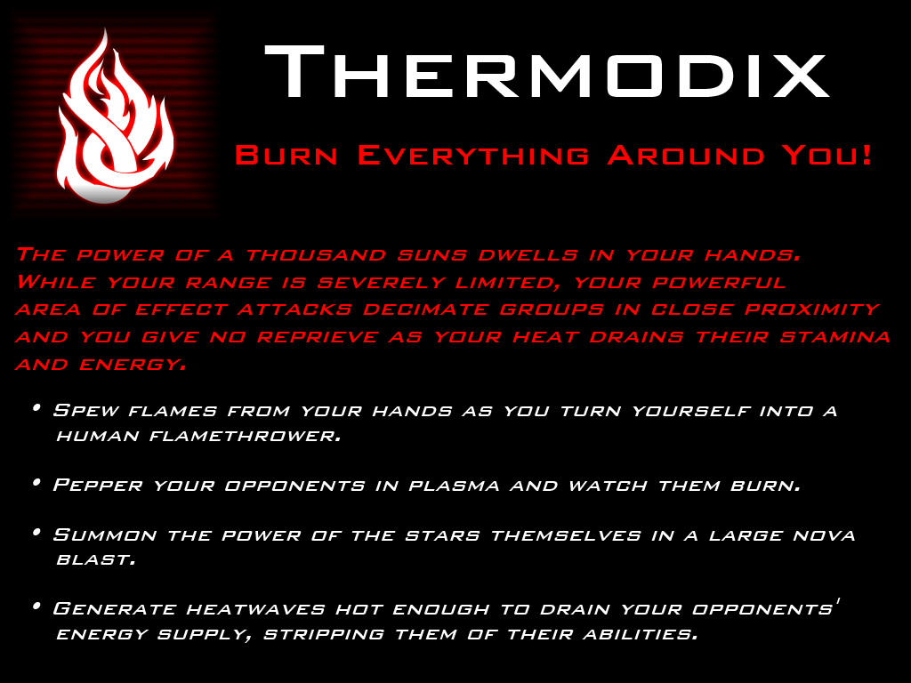
    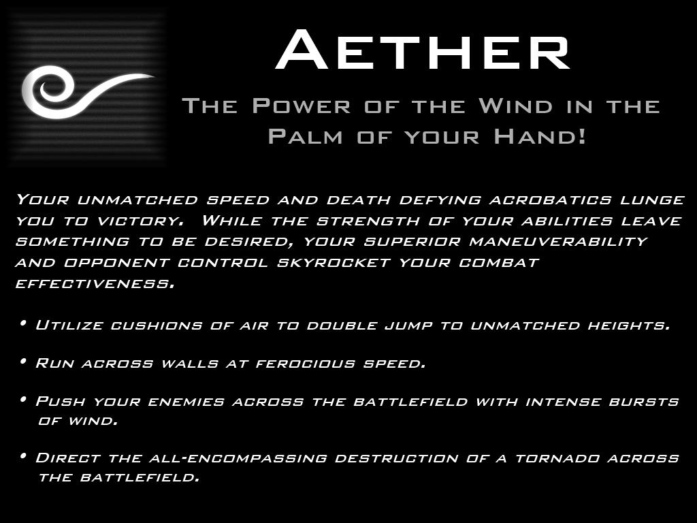
    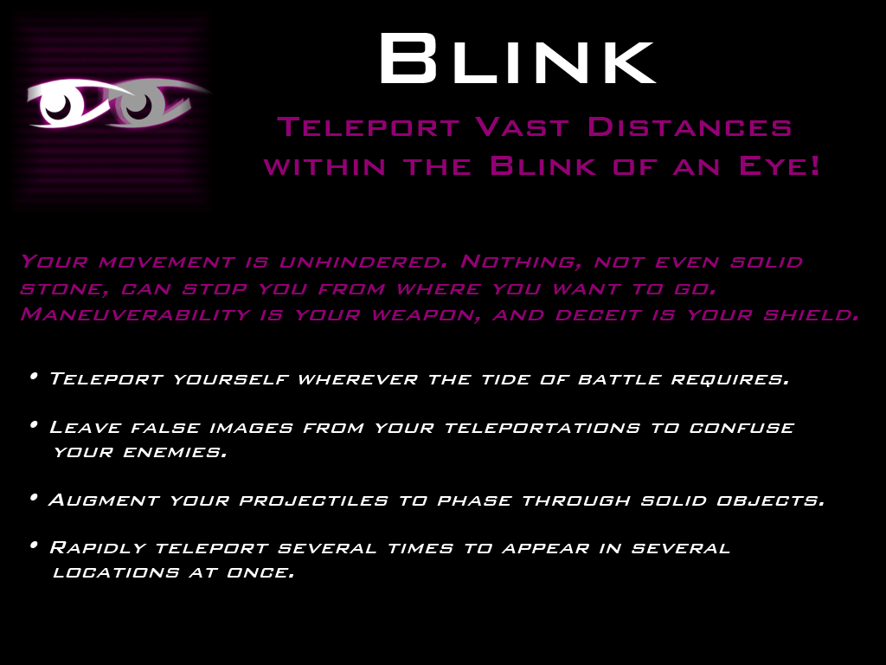
</image-carousel>

We started with lightning, water, and earth abilities, using the "rock-paper-scissors" mechanics to construct these three. The goal was to construct a minimum viable product with these abilities to prove that the game could work. The video below shows an example of one of the earth abilities, called _Rock Wall_. This ability would allow a player to spawn a wall as tall as a person for cover. They could hold down the ability casting button to control how far away from them they wanted the wall to spawn; the longer the button was held, the further the wall spawned. This distance was visualized to the player by a path of rocks that rose out of the ground along the chosen direction.

`video: https://www.youtube.com/embed/_a3q8VNEUrM`

This video showcases the _Shock_ ability, which could damage enemies and electrify any metal objects in the environment. Electrified objects would damage enemies if they touched them. The video also showcases some of the dynamic lighting we were developing for the game.

`video: https://www.youtube.com/embed/NCBWbBeEVBw`

These videos showcase a very late stage of development for the game. Many animations had been created, including walking, running, and jumping animations, as well as animations for casting the different abilities such as _Rock Wall_ and _Shock_. Several weapon types and components had been created modeled, and we were playing around with a level made entirely of pillars that would rise and fall out of the ground as the match progressed, changing the map layout. Most abilities had sound effects, and many particle effects had been created for abilities and weapons. A few pieces of armor and body parts had been modeled, such as the robotic hand seen in the video. 

## Weapons
The weapon system was designed to allow players to essentially construct their own weapons. We even allowed users to name the weapons. There were six weapon types that formed the base of a weapon: projectile, laser, plasma, railgun, beam rifle, and rocket launcher. 

<image-carousel id="nlh-weapons-carousel">
    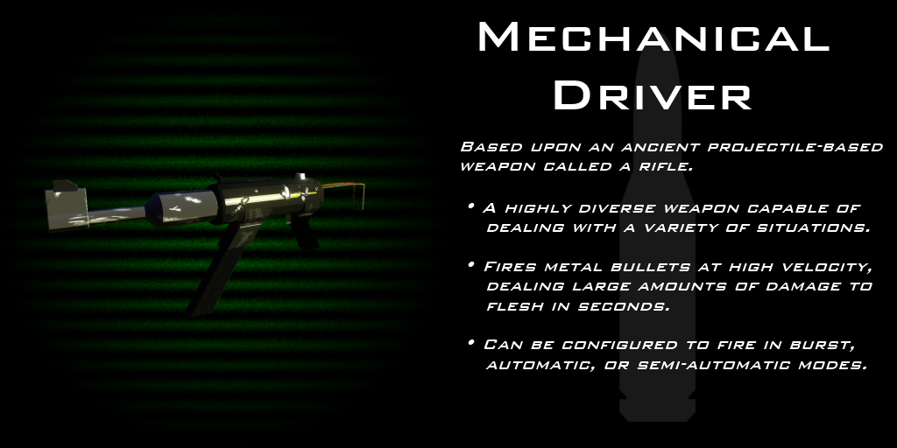
    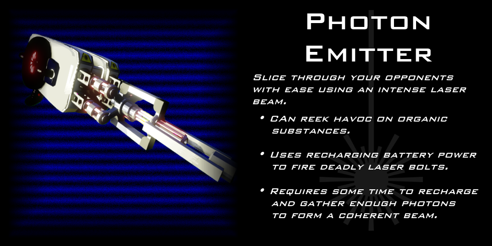
    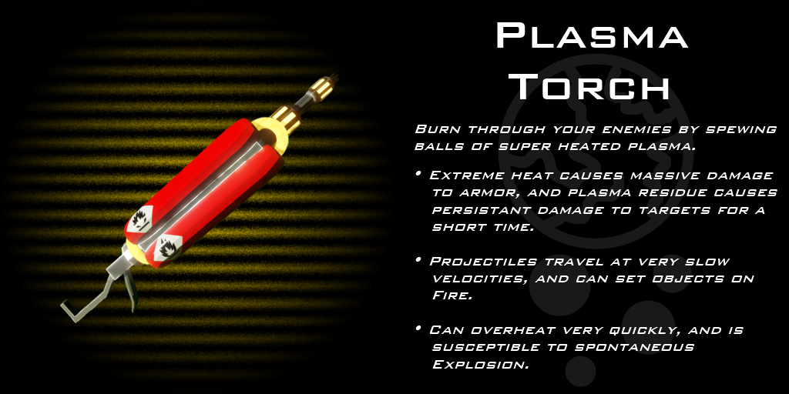
    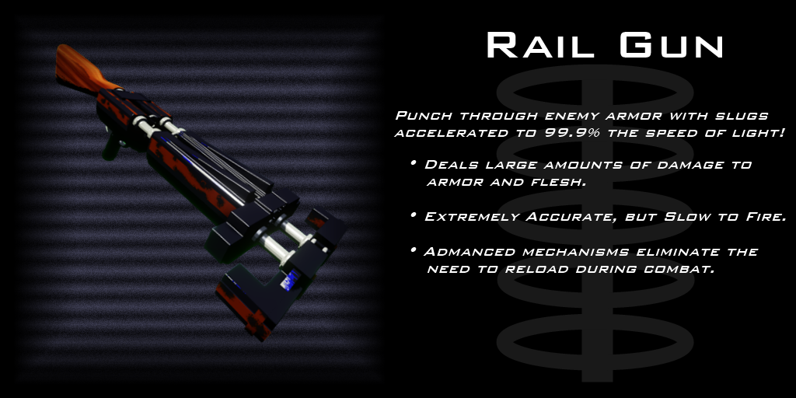
    
    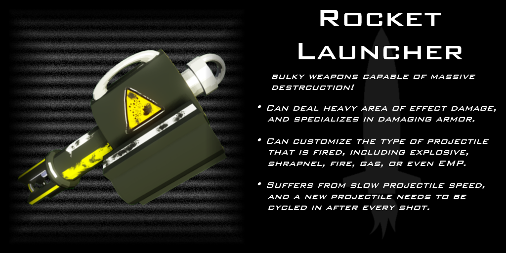
</image-carousel>

Similar to the abilities, each weapon type had a core set of properties. For example, laser guns could reflect off of metal surfaces in the game, beam rifles never needed to be reloaded, and plasma rifles could set flammable things on fire.

After picking a weapon type, the player would add components to the base, including a stock, a barrel, barrel attachments, grips, and optics.

<image-carousel id="nlh-attachments-carousel">
    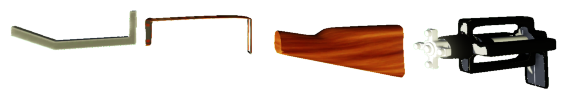
    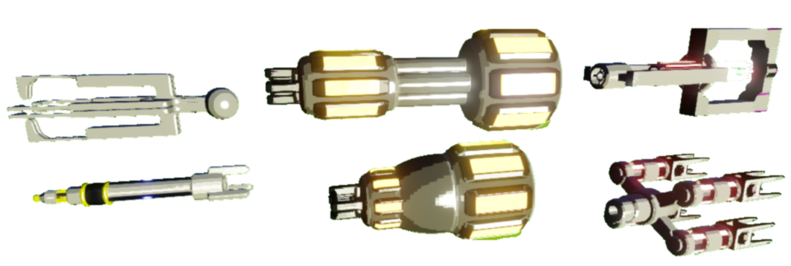
    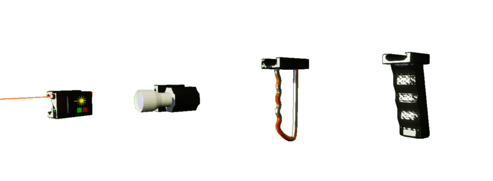
    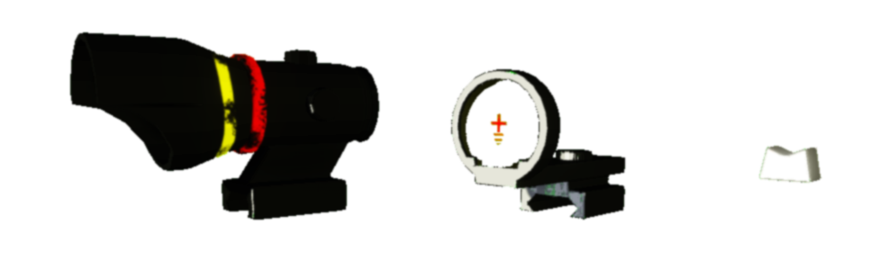
</image-carousel>

## Armor and Body Parts
The player could also customize their character's armor and body parts in a modular manner. Normal body parts could be swapped out for cyborg replacements, including arms, legs, torsos, and eyes. Like weapons, each modular component would alter various properties of the player, and these properties would often interact with abilities. For example, characters that were mostly cyborg would be more affected by lightning abilities. Armor would then stack on top of these system, allowing the player to wear various pieces like gauntlets, shirts, pants, boots, and helmets. 

## Bot Battle
While the game was designed for multiplayer, we needed a gametype to test with that could also serve as a minimum viable product. Bot Battle was a horde mode type, where the player would fight against increasingly difficult waves of robots. We conceived a variety of bot types, though only developed two initially. The first, most basic type was called the Orb, and was a simple floating bot that would fly around and shoot at the player with a laser weapon. These were designed to be easy to kill and the player would face droves of them. The second type was a spider-like bot called the Crawler that would climb onto walls and shoot at the player with plasma.

`video: https://www.youtube.com/embed/BHiWz0tS7no`

## Development
We initially developed the game in Unreal Engine 3 using Unreal Development Kit (UDK). This required writing most of the game's source code in [UnrealScript](https://en.wikipedia.org/wiki/Unreal_Engine#UnrealScript), a custom scripting language used with UE3. UnrealScript is an object-oriented language similar to Java. The default UnrealScript framework that comes with UDK provides many standard features that we utilized, including model and skinned animation support, particle effects, AI, physics and collision testing, and many gameplay mechanics such as weapons and projectiles.

The game's UI was designed using [Scaleform](https://api.unrealengine.com/udk/Three/Scaleform.html), which is a framework that allows Adobe Flash UIs and ActionScript to be run realtime within the game engine. As such, most of the in-game UIs were written in Flash with ActionScript, and then imported using Scaleform.

All of the game's models and animations were developed using [Blender](https://www.blender.org/), which is a free 3D modeling and animation program. While Blender is an excellent option in terms of price, we often struggled to get the models imported properly. Unreal Engine exclusively uses [FBX](https://en.wikipedia.org/wiki/FBX) file formats for models and animations, which is a proprietary format owned by [AutoDesk](https://www.autodesk.com/). Blender provides an FBX exporter, but it is not as fully featured compared to the formats generated by Autodesk's own 3D modeling software, and Unreal Engine would often reject the files. 

When Unreal Engine 4 was released, we decided to try and migrate to the new engine to see if it had the technical capabilities we were looking for. We were especially interested in UE4's physically-based rendering system, which allowed much more realistic lighting and texturing, especially for reflections and shiny materials. Unfortunately, we weren't able to migrate much of our work to the new engine. Unreal Engine 4 dropped the use of UnrealScript, and instead opted for full C++ scripting. This required me to program most of the game's code in C++. Even worse, much of the framework we utilized in UDK and UnrealScript was not present in UE4. Further, most of our assets had to be redone. While our 3D Blender models would be imported, most of our shaders, matierals, textures, and particle effects needed to be redone. Not much progress was made on this version of the game.

## Deployment
Unfortunately, Epic Games has discontinued Unreal Engine 3 and UDK. It is now very difficult to find a usable download of the engine. Because of this, it is unlikely that the UDK version of the game can properly be built. Further, the in-game assets and content take up several gigabytes of memory, and as such I have not made it available for download. While the UnrealScript source may be interesting to look at, without a version of UDK or the content, the UDK version of the game can't be built or run.

## Future
I still want to ultimately return to this game. I feel that the element-based rock-paper-scissors combat is interesting, and want to see it fully implemented. However, as it has been some time since I worked on the project, I feel that there is a lot of concepts that need to be re-evaluated and reworked. Initially we wanted to allow the player to fully customize and own their character, which drove us to go overboard in the amount of modularity allowed. Were I to return to this project, I would probably start by vastly simplifying the weapon and armor system, and focus more on creating tight, clean abilities that give the players a fun experience.