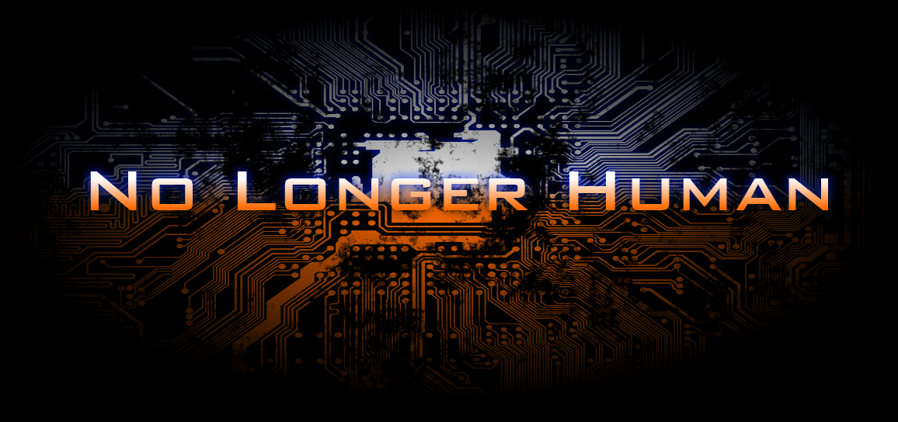

No Longer Human was designed to be a first-person multiplayer arena shooter.  I worked on this game constantly through college, though after graduating (and having a fallout with the friend I was working on it with) haven't gone back to it.

No Longer Human was initially developed in Unreal Engine 3, using Epic's [Unreal Development Kit (UDK)](https://www.unrealengine.com/en-US/previous-versions). After several years of work, I realized that UE3 was not technologically capable of doing what we wanted to do, and Unreal Engine 4 had just come out. I made the decision to switch over to UE4, but this required starting the project over from scratch. Hardly any of the work we had done could be converted to UE4. Not much progress was made on the UE4 version of the game.

## The Elevator Pitch
I conceived the game as a team-based multiplayer arena first-person shooter. Players would pick a class, and each class had a set of abilities that governed its playstyle. A fundamental aspect of these abilities was that they would interact with each other, allowing players to team up and combine abilities together in interesting and unique combinations. Early on, this was dubbed the "rock-paper-scissors" mechanic, where each ability would have strengths and weaknesses that complimented the other abilities. I decided to make the classes based on elements like fire, water, and earth, which allowed each class to embody both a color and concept.

A secondary element of the game was player customizability. The player was able to essentially construct armor, weapons, and body parts using components, and combining different components together would change or grant interesting effects and abilities. There were categories of weapons and armor that gave a base set of proerties, and modular components would be attached to them to vary their properties.

As elemental abilities were a core mechanic, the game also featured a dynamic weather and day/night system that would affect how effective abilities were. For example, a match could start out with fair weather, during which abilities are normally effective. As the match progressed, it could start snowing, which would reduce fire related abilities and weapons and enhance water and ice abilities. This also provided variation to multiplayer maps that are usually not present in most games.

