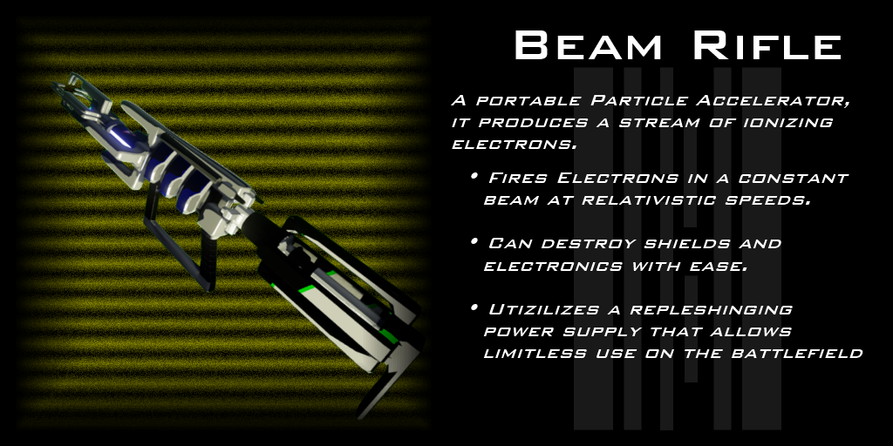

No Longer Human was designed to be a first-person multiplayer arena shooter.  I worked on this game constantly through college, though after graduating (and having a fallout with the friend I was working on it with) haven't gone back to it.

No Longer Human was initially developed in Unreal Engine 3, using Epic's [Unreal Development Kit (UDK)](https://www.unrealengine.com/en-US/previous-versions). After several years of work, I realized that UE3 was not technologically capable of doing what we wanted to do, and Unreal Engine 4 had just come out. I made the decision to switch over to UE4, but this required starting the project over from scratch. Hardly any of the work we had done could be converted to UE4. Not much progress was made on the UE4 version of the game.

## The Elevator Pitch
I conceived the game as a team-based multiplayer arena first-person shooter. Players would pick a class, and each class had a set of abilities that governed its playstyle. A fundamental aspect of these abilities was that they would interact with each other, allowing players to team up and combine abilities together in interesting and unique combinations. Early on, this was dubbed the "rock-paper-scissors" mechanic, where each ability would have strengths and weaknesses that complimented the other abilities. I decided to make the classes based on elements like fire, water, and earth, which allowed each class to embody both a color and concept.

A secondary element of the game was player customizability. The player was able to essentially construct armor, weapons, and body parts using components, and combining different components together would change or grant interesting effects and abilities. There were categories of weapons and armor that gave a base set of proerties, and modular components would be attached to them to vary their properties.

As elemental abilities were a core mechanic, the game also featured a dynamic weather and day/night system that would affect how effective abilities were. For example, a match could start out with fair weather, during which abilities are normally effective. As the match progressed, it could start snowing, which would reduce fire related abilities and weapons and enhance water and ice abilities. This also provided variation to multiplayer maps that are usually not present in most games.

## Abilities
The core mechanics of the game were the abilities. These were organized into elemental classes; lightning, earth, water, fire, air, and teleportation. Each class had a hierarchy of abilities, and these abilities were catered to a specific playstyle. For example, the lightning class was a high-damage one-vs-one class, while the earth class was a support area-of-effect class. 

<image-carousel id="nlh-abilities-carousel">
    
    
    
    
    
    
</image-carousel>

We started with lightning, water, and earth abilities, using the "rock-paper-scissors" mechanics to construct these three. The goal was to construct a minimum viable product with these abilities to prove that the game could work. The video below shows an example of one of the earth abilities, called _Rock Wall_. This ability would allow a player to spawn a wall as tall as a person for cover. They could hold down the ability casting button to control how far away from them they wanted the wall to spawn; the longer the button was held, the further the wall spawned. This distance was visualized to the player by a path of rocks that rose out of the ground along the chosen direction.

`video: https://www.youtube.com/embed/_a3q8VNEUrM`

This video showcases a very late stage of development for the game. Many animations had been created, including walking, running, and jumping animations, as well as animations for casting the different abilities such as _Rock Wall_. Several weapon types and components had been created modeled, and we were playing around with a level made entirely of pillars that would rise and fall out of the ground as the match progressed, changing the map layout. Most abilities had sound effects, and many particle effects had been created for abilities and weapons. A few pieces of armor and body parts had been modeled, such as the robotic hand seen in the video.

##Weapons
The weapon system was designed to allow players to essentially construct their own weapons. We even allowed users to name the weapons. There were six weapon types that formed the base of a weapon: projectile, laser, plasma, railgun, beam rifle, and rocket launcher. 

<image-carousel id="nlh-weapons-carousel">
    
    
    
    
    
    
</image-carousel>

Similar to the abilities, each weapon type had a core set of properties. For example, laser guns could reflect off of metal surfaces in the game, beam rifles never needed to be reloaded, and plasma rifles could set flamable things on fire.

After picking a weapon type, the player would add components to the base, including a stock, a barrel, barrel attachments, grips, and optics.

<image-carousel id="nlh-attachments-carousel">
    
    
    
    
</image-carousel>