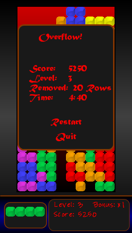
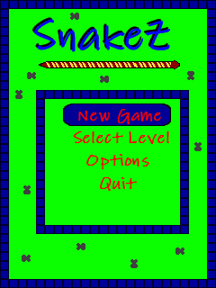

My initial foray into software development began with learning to program video games in [Microsoft's XNA Platform](https://msdn.microsoft.com/en-us/library/bb203894.aspx) for the [Zune](https://en.wikipedia.org/wiki/Zune). For archival purposes, I have listed the games that I developed here.

## Quatrix
A Tetris clone for the Zune and Zune HD.  Featured a standard Tetris game type, customizable brick skins and colors, and an integrated media player to allow the user to access their songs without having to leave the app (the Zune never supported any kind of multitasking function, so running the game normally prevented music from playing).

<image-carousel id="quatrix-hd-carousel">
    
    
    
    
    
</image-carousel>

## Snakez
A [Snake](https://en.wikipedia.org/wiki/Snake_(video_game_genre)) type game made for the Zune. The player controlled a constantly moving snake whose goal was to eat mice. Every mouse eaten would cause the snake to grow. Hitting a wall would cause the snake to die. Featured a handful of levels with various wall configurations and several types of mice.

<image-carousel id="quatrix-hd-carousel">
    
    
    
</image-carousel>

## Untitled Top Down Shooter
A top down shooter where the player navigates rooms and shoots AI controlled enemies. This was never released, and development never made it very far, but I kept on coming back to the concept for years afterward.

<image-carousel id="quatrix-hd-carousel">
    
    
</image-carousel>